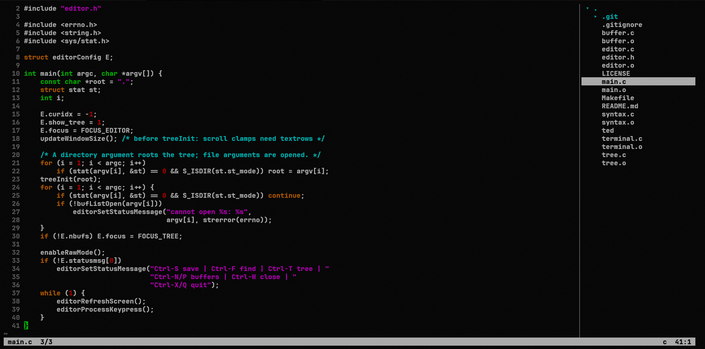

# ted — a tiny terminal code editor with a file tree

I was tired of VS Code and wanted something I could use directly from the terminal,
combining the simplicity of the classic terminal editors with the intuitiveness of VS Code. So I created ted. 

A minimal code editor for the terminal, architecturally derived from
[kilo](https://github.com/antirez/kilo) by Salvatore Sanfilippo (antirez).
Plain C99, POSIX + VT100 escape sequences, **zero dependencies** — no ncurses.
Runs on Linux, WSL, macOS and the BSDs.

~2,750 lines across six small modules, each with a single owner for every
allocation. The exit path frees everything: the test suite runs under
AddressSanitizer + LeakSanitizer + UBSan with zero findings.

## Build

    make            # optimized binary ./ted
    make test       # end-to-end regression suite (needs python3; see tests/)
    make test-asan  # same suite under ASan/UBSan — the memory audit
    make asan       # instrumented build (ASan + UBSan) for development
    make memcheck   # run under valgrind, if installed

## Usage

    ./ted                 # file tree of the current directory
    ./ted src/            # root the tree at a directory
    ./ted file.c [more]   # open file(s); a new name creates a new file

## Keys

| Key              | Action                                        |
|------------------|-----------------------------------------------|
| `Ctrl-X` / `Ctrl-Q` | quit (asks again if there are unsaved changes) |
| `Ctrl-S`         | save (atomic: temp file + rename, never a half-written file) |
| `Ctrl-F`         | incremental search (arrows: next/prev, `Esc`: cancel) |
| `Ctrl-R`         | search & replace: `y` this, `n` skip, `a` all, `q` stop |
| `Ctrl-G`         | go to line                                    |
| `Ctrl-Z` / `Ctrl-Y` | undo / redo (typed/deleted runs as one step) |
| `Ctrl-E`         | toggle soft line wrap (auto-on for plain-text files) |
| `Ctrl-←` / `Ctrl-→` | move by word                               |
| `Ctrl-↑` / `Ctrl-↓` | jump to previous / next blank line         |
| `Ctrl-Del` / `Ctrl-Backspace` | delete word after / before cursor |
| `Shift-arrows/Home/End` | select (add `Ctrl` for word-wise); `Esc` clears |
| `Ctrl-L` / `Ctrl-A` | select line (repeat to extend) / select all |
| `Ctrl-C` / `Ctrl-K` / `Ctrl-V` | copy / cut / paste (line when nothing selected; `Ctrl-U` also pastes, nano-style) |
| `Ctrl-T`         | switch focus editor ⇄ tree                    |
| `Ctrl-B`         | show/hide the tree pane                       |
| `Ctrl-N` / `Ctrl-P` | next / previous buffer                     |
| `Ctrl-W`         | close current buffer                          |
| Mouse            | click places cursor / opens from tree, drag selects, wheel scrolls |

In the tree: arrows move (`←` collapses / jumps to parent, `→` expands),
`Enter` opens, `R` re-scans the selected directory, `.` toggles hidden files,
`n` creates a file (written to disk on first save), `N` creates a directory.
Newly saved files appear in the tree automatically. The pane sizes itself
to the widest visible entry (up to 40% of the terminal), so deeply nested
names stay readable; anything that still doesn't fit ends in `…`.

Long lines soft-wrap for plain-text buffers (anything without syntax
highlighting: `.txt`, `.md`, logs, …) so prose is always fully readable;
code files scroll horizontally as usual, and `Ctrl-E` flips either mode
per buffer. Wrapped continuation lines get a blank gutter, and `↑`/`↓`
move by visual line inside a wrapped row.

Editing: auto-indent on Enter, Tab inserts spaces (width 4, `TAB_WIDTH` in
`editor.h`), bracketed paste keeps pasted text verbatim. Syntax highlighting
for C, Python, shell, Makefile, JSON and assembly (NASM `;` and GAS `#`
dialects, picked by extension) — each language is ~15 data lines in
`syntax.c`, so adding more is trivial.
Typing, Enter, Tab or `Ctrl-V` over a selection replaces it — one undo step.
Copies are also offered to the system clipboard via OSC 52 (supported by
Windows Terminal, xterm, tmux, …); to paste *from* the system clipboard use
your terminal's paste key (bracketed paste handles it).

## Layout

    main.c      init + main loop
    terminal.c  raw mode, key/mouse/resize decoding
    buffer.c    text rows, editing ops, file I/O, buffer list
    editor.c    rendering, dispatch, search, prompts
    tree.c      lazy-loading file tree
    syntax.c    highlighting engine + language table

## Known limits (v1)

- `Ctrl-Backspace` relies on the terminal sending `0x08` (Windows Terminal,
  xterm, etc.); on terminals where plain Backspace sends `0x08`, Backspace
  will delete a word — kilo's legacy `Ctrl-H` alias was rebound for this.
- Byte-oriented like kilo: UTF-8 text renders, but cursor motion counts
  bytes, not characters.
- No native Windows console; use WSL.
